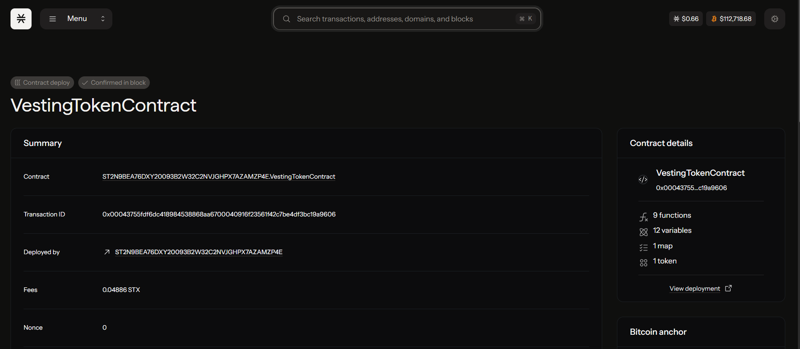

# Vesting Token Contract

## Project Description

The Vesting Token Contract is a Clarity smart contract designed to implement controlled token distribution through linear and cliff vesting schedules. This contract allows project owners to create vesting schedules for team members, advisors, or investors, ensuring tokens are released gradually over time rather than all at once. The contract supports both cliff periods (where no tokens are released initially) and linear vesting (where tokens are released proportionally over the vesting duration).

## Project Vision

Our vision is to provide a robust, secure, and transparent token vesting solution for blockchain projects built on the Stacks ecosystem. By implementing proper vesting mechanisms, we aim to:

- **Promote Long-term Commitment**: Encourage stakeholders to remain committed to projects through gradual token release
- **Reduce Market Volatility**: Prevent large token dumps by controlling the release schedule
- **Enhance Trust**: Provide transparent and immutable vesting schedules that all parties can verify
- **Support Fair Distribution**: Enable equitable token distribution across different stakeholder groups
- **Facilitate Compliance**: Help projects meet regulatory requirements for token distribution

## Future Scope

The Vesting Token Contract has several areas for future enhancement and expansion:

### Phase 1 Enhancements
- **Multiple Vesting Types**: Support for different vesting curves (exponential, step-wise, custom schedules)
- **Revocable Vesting**: Allow contract owners to revoke unvested tokens under specific conditions
- **Delegation Support**: Enable beneficiaries to delegate their vested tokens while maintaining vesting schedules

### Phase 2 Features
- **Batch Operations**: Implement batch creation of multiple vesting schedules to reduce transaction costs
- **Governance Integration**: Connect with DAO governance systems for community-controlled vesting parameters
- **Multi-token Support**: Extend the contract to handle vesting for multiple different tokens

### Phase 3 Advanced Features
- **Dynamic Vesting**: Implement performance-based vesting that adjusts based on project milestones
- **Cross-chain Compatibility**: Explore integration with other blockchain networks
- **Advanced Analytics**: Provide comprehensive vesting analytics and reporting tools
- **Mobile Integration**: Develop mobile applications for easy vesting schedule management

### Long-term Vision
- **DeFi Integration**: Connect with decentralized finance protocols for additional utility of vested tokens
- **NFT Vesting**: Extend vesting concepts to non-fungible tokens and digital assets
- **Enterprise Solutions**: Develop enterprise-grade vesting solutions for large organizations

*Note: The actual contract addresses will be updated once the contract is deployed to the respective networks. Users should always verify contract addresses through official channels before interacting with the contract.*

---

## Key Functions

### Core Vesting Functions

1. **create-vesting-schedule**: Creates a new vesting schedule for a beneficiary
   - Parameters: beneficiary address, total amount, cliff duration, vesting duration
   - Access: Contract owner only

2. **release-vested-tokens**: Allows beneficiaries to claim their vested tokens
   - Parameters: None (uses tx-sender as beneficiary)
   - Access: Beneficiaries only

### Read-Only Functions

- `get-vesting-schedule`: View vesting schedule details for a beneficiary
- `get-releasable-amount`: Check how many tokens can currently be released
- `get-balance`: Check token balance of any address
- Standard token metadata functions (name, symbol, decimals, total supply)

## Security Features

- **Access Control**: Only contract owner can create vesting schedules
- **Cliff Protection**: Tokens cannot be released before cliff period ends
- **Balance Validation**: Ensures sufficient token balance before any operations
- **Immutable Schedules**: Once created, vesting schedules cannot be modified

## Getting Started

1. Deploy the contract to Stacks network
2. Create vesting schedules using `create-vesting-schedule`
3. Beneficiaries can check their vesting status and claim tokens using `release-vested-tokens`
4. Monitor vesting progress through read-only functions

For detailed usage examples and integration guides, please refer to the project documentation.

### Contract Details
Contract Address:
ST2N9BEA76DXY20093B2W32C2NVJGHPX7AZAMZP4E.VestingTokenContract
Screenshot:
